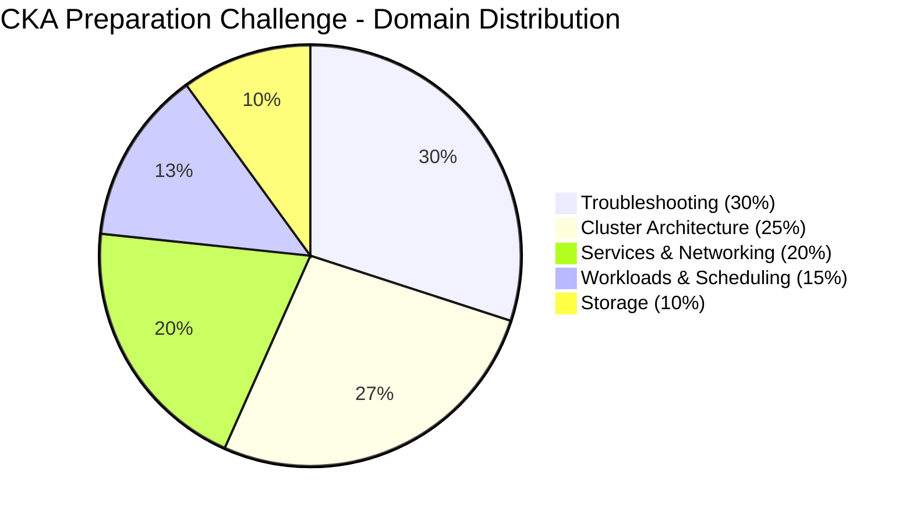

# CKA Daily Helper Completion Plan

This document outlines the plan to complete the 'daily-helper.md' guide for Days 13 through 30 of the 30-Day CKA Preparation Challenge. The plan emphasizes Troubleshooting due to its 30% weight in the CKA exam while ensuring all competencies are covered as per the official study plan. Each day's guide follows the existing structure in 'daily-helper.md', including challenge overviews, helpful hints, topics to explore, grading criteria, and solutions.

## Plan for Completing 'daily-helper.md' (Days 13-30)

### Week 2: Storage and Troubleshooting Basics (Continued)
- **Day 13: Troubleshooting - Troubleshoot Misconfigured Service**
  - **Focus**: Deep dive into service troubleshooting with practical scenarios.
  - **Content**: Cover identifying and resolving service misconfigurations by examining container output streams and logs. Include advanced log analysis techniques using built-in commands like `kubectl logs` and `kubectl describe`.
  - **Competency Mapping**: Troubleshoot services and networking, manage and evaluate container output streams.
  - **Emphasis**: Provide multiple failure scenarios (e.g., incorrect port mappings, selector mismatches) to enhance troubleshooting skills. Focus on reasoning and quick problem-solving without external tools. Add practical examples such as misconfigured service selectors and missing endpoints, guiding users through reasoning steps to identify issues.

### Week 3: Advanced Configuration and Networking
- **Day 14: Cluster Architecture, Installation & Configuration - Use Helm for Application Installation**
  - **Focus**: Practical use of Helm for managing complex deployments.
  - **Content**: Guide on installing and customizing applications using Helm charts, with examples like Nginx. Include troubleshooting Helm installation issues.
  - **Competency Mapping**: Use Helm and Kustomize to install cluster components.
- **Day 15: Cluster Architecture, Installation & Configuration - Explore Kustomize for Configurations**
  - **Focus**: Managing resources declaratively with Kustomize.
  - **Content**: Instructions on applying resources with patches using Kustomize, comparing it with Helm for configuration management.
  - **Competency Mapping**: Use Helm and Kustomize to install cluster components.
- **Day 16: Cluster Architecture, Installation & Configuration - Install CNI Plugin**
  - **Focus**: Understanding networking extensions in Kubernetes.
  - **Content**: Steps to install a CNI plugin like Calico or Flannel, with tests to observe networking behavior changes.
  - **Competency Mapping**: Understand extension interfaces (CNI, CSI, CRI, etc.).
- **Day 17: Services & Networking - Set Up Ingress Controller and Resources**
  - **Focus**: Managing external traffic to services.
  - **Content**: Guide on installing an Ingress controller and defining Ingress resources, with connectivity tests.
  - **Competency Mapping**: Know how to use Ingress controllers and Ingress resources.
- **Day 18: Services & Networking - Use Gateway API for Traffic Routing**
  - **Focus**: Advanced traffic management.
  - **Content**: Instructions on configuring Gateway API for routing, with scenarios for different workloads.
  - **Competency Mapping**: Use the Gateway API to manage Ingress traffic.
- **Day 19: Services & Networking - Configure CoreDNS for Custom Resolution**
  - **Focus**: DNS management within the cluster.
  - **Content**: Steps to customize CoreDNS configurations and troubleshoot DNS resolution issues.
  - **Competency Mapping**: Understand and use CoreDNS.

### Week 4: Advanced Workloads, Troubleshooting, and Review
- **Day 20: Workloads & Scheduling - Perform Rolling Updates and Rollbacks**
  - **Focus**: Application deployment lifecycle management.
  - **Content**: Guide on executing rolling updates and testing rollbacks, ensuring zero downtime.
  - **Competency Mapping**: Understand application deployments and how to perform rolling updates and rollbacks.
- **Day 21: Workloads & Scheduling - Configure Workload Autoscaling**
  - **Focus**: Dynamic resource allocation.
  - **Content**: Steps to set up Horizontal Pod Autoscaler (HPA) based on metrics like CPU, with performance monitoring.
  - **Competency Mapping**: Configure workload autoscaling.
- **Day 22: Troubleshooting - Simulate Networking Issue**
  - **Focus**: In-depth network troubleshooting.
  - **Content**: Simulate a pod-to-service connectivity issue, using diagnostic approaches with `kubectl exec` for basic checks. Include multiple failure points (e.g., Network Policy misconfiguration, service endpoint issues).
  - **Competency Mapping**: Troubleshoot services and networking.
  - **Emphasis**: Detailed scenarios and step-by-step diagnostic approaches to reinforce troubleshooting skills. Add practical examples like DNS resolution failures, guiding users to inspect Network Policies and service DNS names through reasoning and systematic elimination of causes.
- **Day 23: Troubleshooting - Troubleshoot Failing Application Deployment**
  - **Focus**: Application deployment diagnostics.
  - **Content**: Analyze events and pod status to resolve deployment failures, covering common issues like image pull errors or resource limits.
  - **Competency Mapping**: Troubleshoot clusters and nodes.
  - **Emphasis**: Provide varied failure cases and recovery strategies. Add examples like incorrect ConfigMap references, walking through reasoning with `kubectl events` and `kubectl describe pod`.
- **Day 24: Troubleshooting - Optimize Cluster Performance Under Contention**
  - **Focus**: Resource contention resolution.
  - **Content**: Create a high resource contention scenario and optimize performance by adjusting limits or scheduling.
  - **Competency Mapping**: Monitor cluster and application resource usage.
  - **Emphasis**: Focus on practical optimization techniques using built-in commands. Provide scenarios of CPU or memory overcommitment with examples of pod throttling, guiding users to analyze with `kubectl describe nodes` and deduce strategies.
- **Day 25: Troubleshooting - Conduct Full Cluster Health Check**
  - **Focus**: Comprehensive cluster diagnostics.
  - **Content**: Perform a full health check, identifying and fixing multiple issues across nodes, components, and workloads. Include checklists for systematic troubleshooting.
  - **Competency Mapping**: Troubleshoot cluster components.
  - **Emphasis**: Extensive guide with multiple simulated issues for exam preparation. Include diverse issues like node NotReady status and pod scheduling failures, offering diagnosis steps with `kubectl get` and log inspection.
- **Day 26: Cluster Architecture, Installation & Configuration - Implement CRD and Operator**
  - **Focus**: Extending Kubernetes functionality.
  - **Content**: Steps to define and deploy a Custom Resource Definition (CRD) and an operator, with practical use cases.
  - **Competency Mapping**: Understand CRDs, install and configure operators.
- **Day 27: Cluster Architecture, Installation & Configuration - Simulate Cluster Upgrade**
  - **Focus**: Cluster lifecycle management.
  - **Content**: Guide on upgrading a cluster using kubeadm, including rollback procedures and version compatibility checks.
  - **Competency Mapping**: Manage the lifecycle of Kubernetes clusters.
- **Day 28: Storage - Manage Persistent Volumes Manually**
  - **Focus**: Manual storage management.
  - **Content**: Instructions on creating and binding Persistent Volumes (PVs) to PVCs manually, testing data persistence across pod restarts.
  - **Competency Mapping**: Manage persistent volumes and persistent volume claims.
- **Day 29: Review and Mock Exam - Review Key Concepts**
  - **Focus**: Consolidation of knowledge.
  - **Content**: Summarize key concepts from all domains, with references to previous days’ challenges for revisit.
  - **Competency Mapping**: Covers all domains for comprehensive review.
- **Day 30: Review and Mock Exam - Perform Mock Exam Scenario**
  - **Focus**: Exam simulation.
  - **Content**: Design a timed mock exam combining tasks from multiple domains (e.g., deploying an app with networking, storage, and RBAC constraints), with evaluation criteria.
  - **Competency Mapping**: Integrates all competencies for practical application.

## Domain Distribution Visualization
To illustrate the distribution of days across domains and the emphasis on Troubleshooting, the following Mermaid diagram is provided:

This plan ensures all CKA competencies are addressed, with an enhanced focus on Troubleshooting through detailed scenarios and diagnostic depth on Days 13, 22, 23, 24, and 25, using only built-in Kubernetes commands to align with exam constraints.